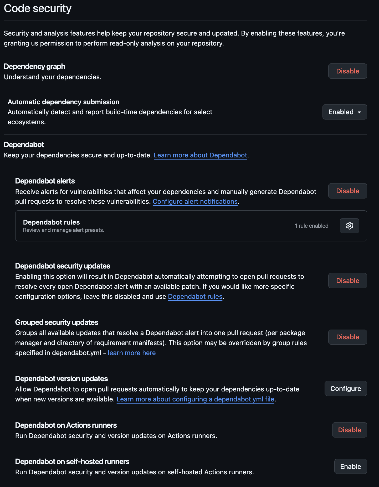

# Security Policy

This repository stores ONLY the community artifacts.
We rely on peer review.

## Mimis Vitr Conventions

- Project [Gervi Héra Viskr Learning Trails](https://github.com/orgs/Gervi-Hera-Vitr/projects/1/views/1) -- [_Roadmap View_](https://github.com/orgs/Gervi-Hera-Vitr/projects/1/views/4)

_The security setup is limited to necessary concepts._

- Organization Security
    - [Code security configurations](https://github.com/organizations/Gervi-Hera-Vitr/settings/security_products)
    - [Global code security settings](https://github.com/organizations/Gervi-Hera-Vitr/settings/security_analysis)
    - [Dependabot](https://docs.github.com/en/code-security/dependabot/dependabot-security-updates/configuring-dependabot-security-updates); GH Actions [troubleshooting Dependabot issues](https://docs.github.com/en/code-security/dependabot/troubleshooting-dependabot/troubleshooting-dependabot-on-github-actions#restrictions-when-dependabot-triggers-events)
- [Installed GitHub Apps](https://github.com/organizations/Gervi-Hera-Vitr/settings/installations)
  - [Renovate](https://github.com/organizations/Gervi-Hera-Vitr/settings/installations/56638914); docs home -- [mend.io renovate docs](https://docs.renovatebot.com/); how it works [renovate](https://docs.renovatebot.com/key-concepts/how-renovate-works/)
  - [Qodana Cloud](https://github.com/organizations/Gervi-Hera-Vitr/settings/installations/57581823)
  - [Codacy Production](https://github.com/organizations/Gervi-Hera-Vitr/settings/installations/56414417)
- [Qodana -- Mimis Gildi -- The Scene](https://qodana.cloud/teams/zqLmn)
- [Asset Repositories](https://github.com/orgs/Gervi-Hera-Vitr/repositories)
  - [sindri-labs](https://github.com/Gervi-Hera-Vitr/sindri-labs) -- _**Main Homeschool Assets Repository**_
    - 

## Mimir Organizations

- [Gervi Héra Vitr](https://github.com/Gervi-Hera-Vitr)
  - [Vitr Runners](https://github.com/organizations/Gervi-Hera-Vitr/settings/actions/runners)
  - [Vitr General actions permissions](https://github.com/organizations/Gervi-Hera-Vitr/settings/actions)

Visible to organization:

